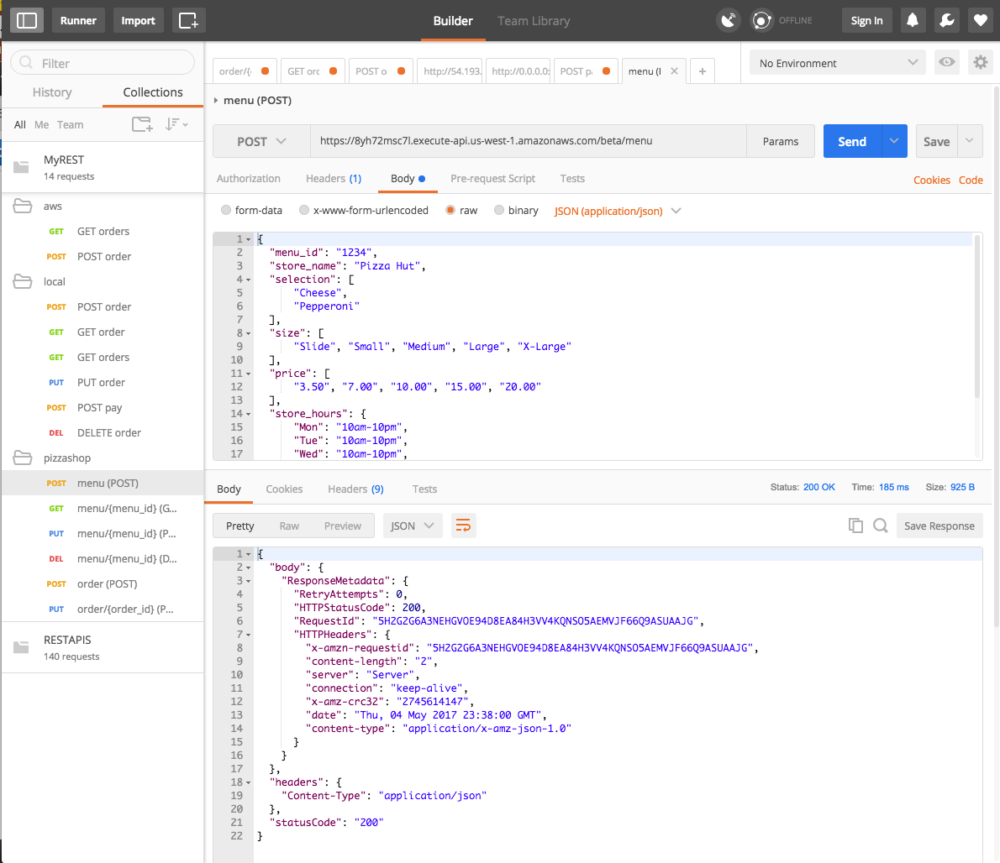
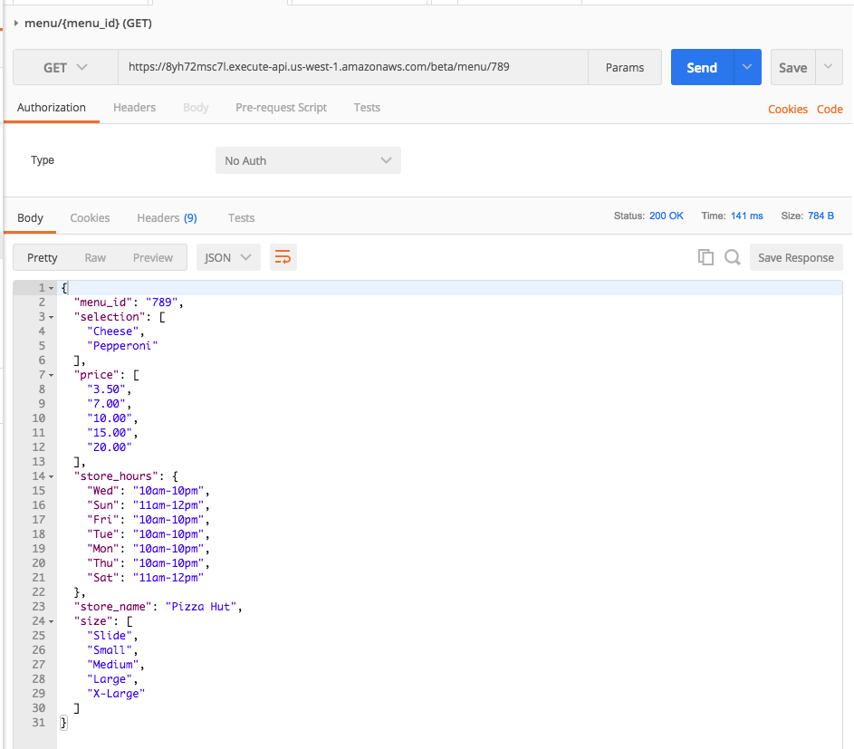
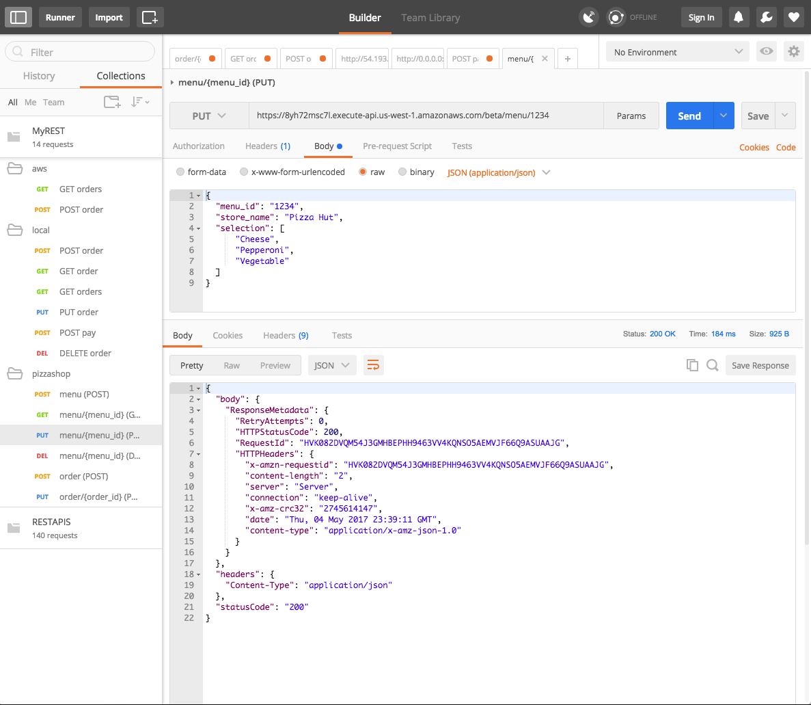
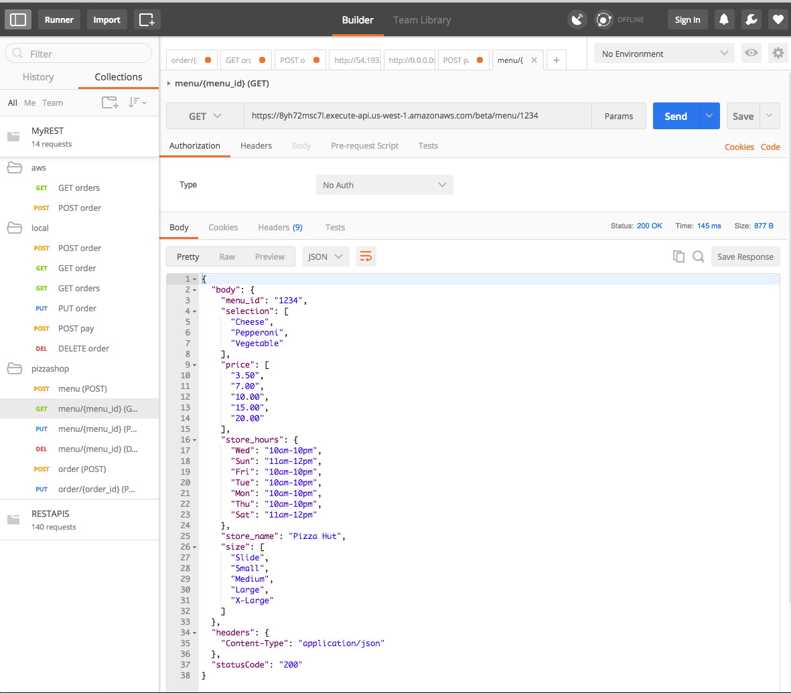
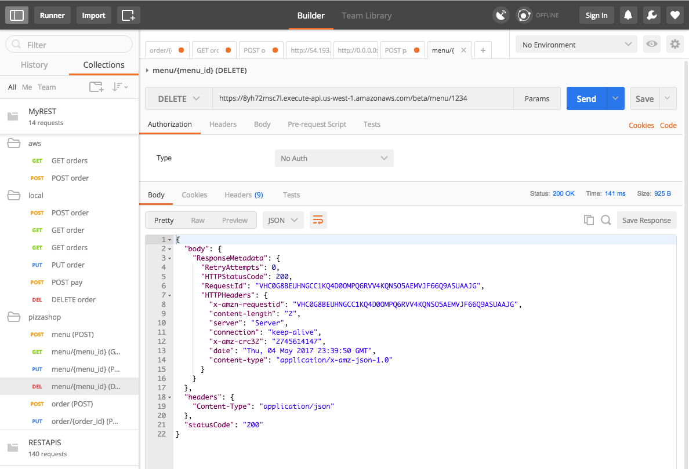
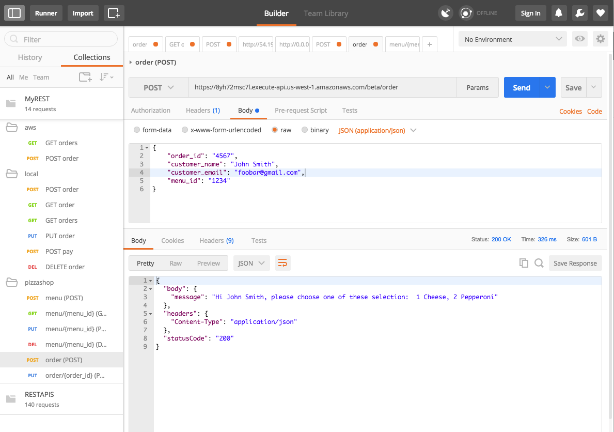
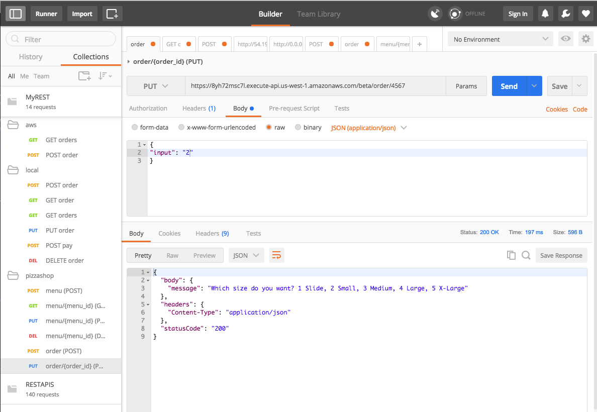
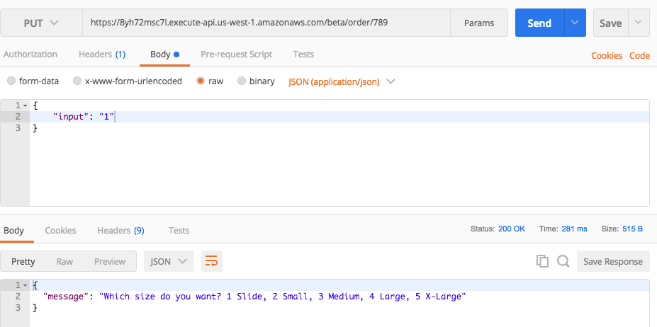

### Assignment Submission

[mypizzashop-menu](https://github.com/kanghuawu/cmpe273-spring17/tree/master/assignment2/mypizzashop-menu)

[mypizzashop-order](https://github.com/kanghuawu/cmpe273-spring17/tree/master/assignment2/mypizzashop-order)

1. POST menu

2. GET menu

3. PUT menu

4. GET menu

5. DELETE menu

7. POST order

8. PUT order

9. PUT order
