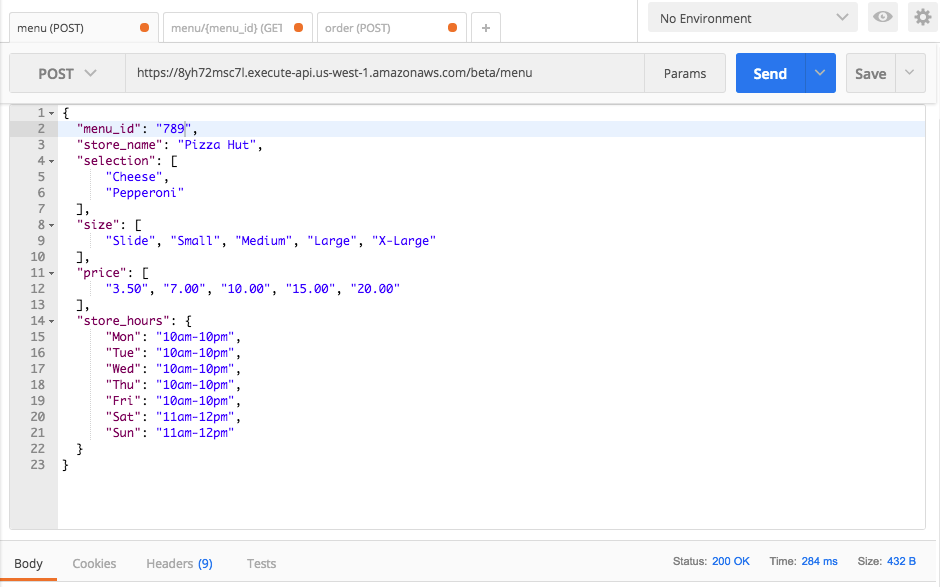
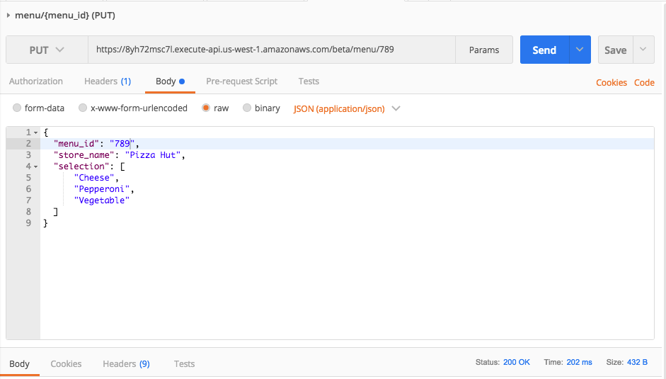
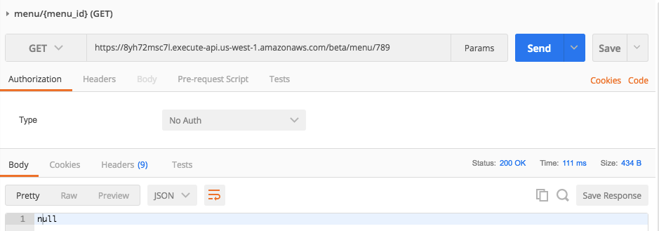
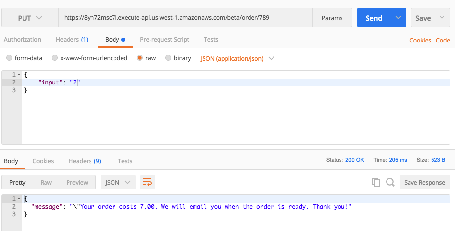

### Assignment Submission

- [api_gateway setup](https://github.com/kanghuawu/cmpe273-spring17/tree/master/assignment2/api_gateway)
api_map_template_req is for mapping resquest.
api_map_template_res is for mapping response.

- [mypizzashop menu](https://github.com/kanghuawu/cmpe273-spring17/tree/master/assignment2/mypizzashop-menu)

[mypizzashop order](https://github.com/kanghuawu/cmpe273-spring17/tree/master/assignment2/mypizzashop-order)

1. POST menu

2. GET menu

3. PUT menu

4. GET menu

5. DELETE menu

6. GET menu

7. POST order

8. PUT order

9. PUT order

6. GET order
