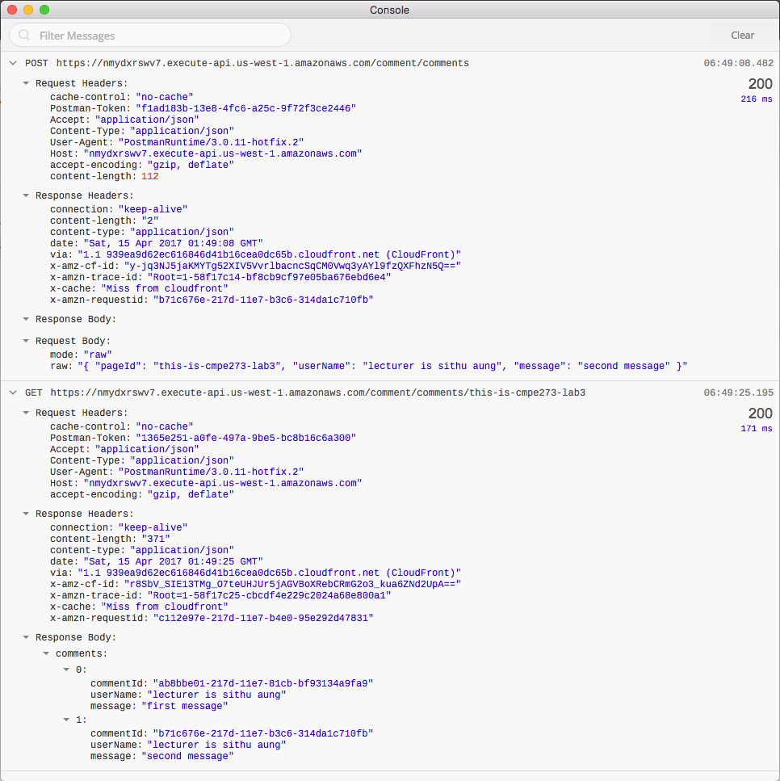

# Access Amazon DynamoDB through AWS Gateway 

This is step-by-step walk through for lab 3 of class cmpe273. The steps are based on following two links. The first link was provided by lecturer which was a blog by aws architect. However, it missed out how to setup IAM for the gateway and second link has complementary instructions for the first link.

* [AWS Post](https://aws.amazon.com/blogs/compute/using-amazon-api-gateway-as-a-proxy-for-dynamodb/)

* [youtube link](https://www.youtube.com/watch?v=TuGyyTXPQ-U)

Postman console result

still working on steps...
will be posted later...